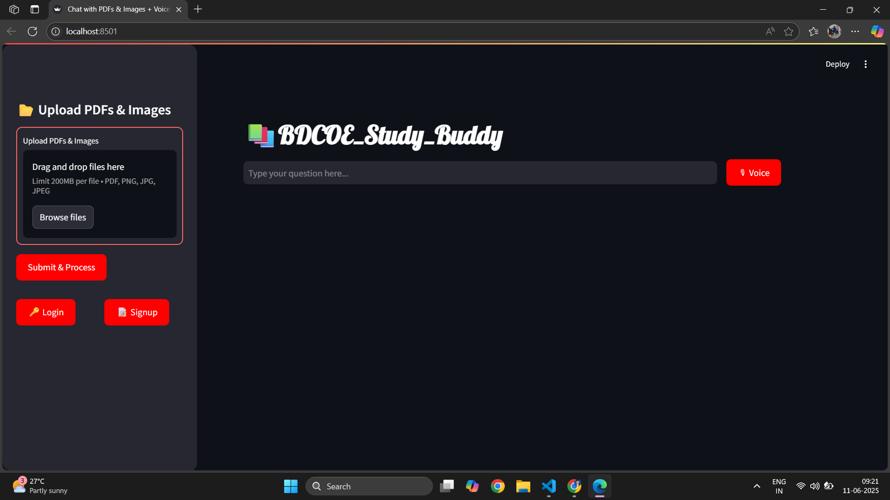

# 🧠 Training LLM Using Custom PDFs

A smart assistant that lets you **chat with your PDF files** using the power of Large Language Models (LLMs).  
Built with **LangChain**, **Google Generative AI**, **ChromaDB**, **FAISS**, and **Streamlit**, this project enables natural language question-answering from any uploaded PDF document.

---

## 📄 Project Overview

This project solves the problem of navigating large PDF files manually. Instead, it allows users to upload PDFs and ask questions in natural language. Using **Retrieval-Augmented Generation (RAG)**, the system finds the most relevant chunks of text and generates contextual answers using an LLM such as **Google Gemini** (via `google-generativeai`).

---

## 📸 Chat_With-PDFs

> 💡 User Interface.

<p align="center">
  
</p>

---

## 🔧 Features

- 📄 Upload multiple PDF files
- ✂️ Split and chunk text intelligently
- 📊 Generate semantic embeddings
- 🧠 Store and retrieve vectors with ChromaDB or FAISS
- 💬 Ask questions and receive LLM-generated answers
- 🖥️ Simple, interactive UI using Streamlit

---

## ⚙️ Technologies Used

| Technology                | Purpose                                                  |
|--------------------------|----------------------------------------------------------|
| 🐍 Python                | Core programming language                                |
| 📄 PyPDF2                | Extracts text from PDF files                             |
| 🧠 LangChain             | RAG pipeline and LLM integration                         |
| 💬 Streamlit             | Web-based chat interface                                 |
| 📊 ChromaDB              | Vector store for document chunks                         |
| 📌 FAISS (CPU)           | High-speed vector similarity search                      |
| 🔐 python-dotenv         | Manage API keys via `.env` file                          |
| 🤖 google-generativeai   | Access Google Gemini (PaLM 2) models                     |
| 🔗 langchain-google-genai| LangChain wrapper for Google Generative AI               |

---

## 🛠️ How to Run

```bash
# 1. Clone the repo
git clone https://github.com/your-username/llm-custom-pdf.git
cd llm-custom-pdf

# 2. (Optional) Set up a virtual environment
python -m venv venv
source venv/bin/activate  # Windows: venv\Scripts\activate

# 3. Install required packages
pip install -r requirements.txt

# 4. Add your API key to a .env file
GOOGLE_API_KEY=your-key-here

# 5. Run the app
streamlit run main.py
